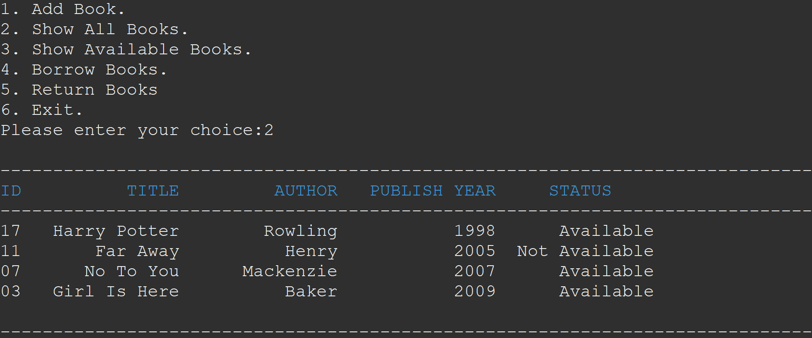

# Library Management Application Documentation



## Overview

Welcome to the Library Management Application, a Java-based solution for efficient book management. This application allows users to perform various tasks, including adding books, viewing available books, borrowing books, and returning books. It ensures seamless management of the library's inventory and tracks the availability of each book.

## Features

### 1. Adding Books

Users can add new books to the library by providing essential details such as the book Id, title, author, published year. The application ensures accurate and secure storage of book records.

### 2. Showing All Available Books

The "Show All Books" feature allows users to access a comprehensive list of all available books in the library. This list includes details such as the book Id, title, author, published year and availability status.

### 3. Borrowing Books

Users can borrow books from the library by selecting a specific book Id and checking its availability. The application checks for the book's availability before allowing the borrowing transaction. If the book is available, it is marked as borrowed.

### 4. Returning Books

Once a user has finished reading a book, they can return it to the library using the "Return Book" feature. The application updates the book's availability status, making it available for other users to borrow.

### 5. Book Availability Check

Before allowing a user to borrow a book, the application checks its availability. If the book is currently on loan, the user is informed, ensuring fair access to library resources.

## How to Use

1. **Adding Books**: Select the "Add Book" option, provide the necessary book details, and submit the information for storage in the library database.

2. **Showing All Available Books**: Choose the "Show All Books" option to see a comprehensive list of available books, including their details and availability status.

3. **Borrowing Books**: Navigate to the "Borrow Book" section, select a specific book, and check its availability. If available, proceed with the borrowing process.

4. **Returning Books**: Use the "Return Book" feature to return a borrowed book to the library. The application updates the book's availability status accordingly.

## Sample Code

```java
// Sample code snippet for adding a book
do {
			menu();
			System.out.print("Please enter your choice:");
			int choice = sc.nextInt();		
			switch(choice) {
			
			case 1:
				service.addBook();
                break;
            case 2:
                service.showAllBooks();
                break;
            case 3:
                service.showAllAvailableBooks();
                break;
            case 4:
                service.borrowBook();
                break;
            case 5:
                service.returnBook();
                break;
			
			case 6:
				System.out.println("Thanks for using the Application!!!");
				flag=false;
				break;
			
			default:
				System.out.println("Please choose the correct option.");
				break;
				
			}
		}while(flag);
		
}
